# Author: Tasfia Mehbuba Islam
Lab 2 Flask Web Development + Docker

This repo is a clone of https://github.com/miguelgrinberg/flasky

### Activity 1.2: Creating a repo and replay the textbook example

Install Flask, run flask within ECE444-F2024-PRA2 following instructions:
https://flask.palletsprojects.com/en/3.0.x/installation/

## Activity 1.2: Example 2-1

## Activity 1.2: Example 2-2

### Activity 1.3: Replaying and modifying example in Chapter 3 

### Activity 1.4: Replaying and modifying example in Chapter 4

## Activity 1.4: step 1 - Example 4-7 (Hello Stranger, What is your name?)

Alongside installing, running flask in Activity 1.4 had to install flask-wtf wtforms otherwise import doesn't work

After installing flask within the active virtual environment, then do : pip install Flask-WTF WTForms
then do flask run

Then go to http://127.0.0.1:5000/

## Activity 1.4: step 2 - Email, Name - Hello, Stranger!

Alongside installing, running flask in Activity 1.4 had to install flask-wtf wtforms, email-validators otherwise import doesn't work.

After installing flask within the active virtual environment, then do : pip install Flask-WTF WTForms
then do pip install email-validator

Optional step: to verify installation: pip freeze

Then do flask run

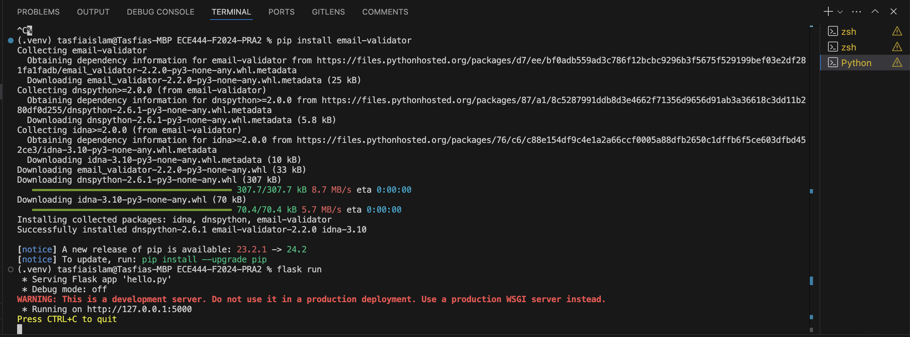

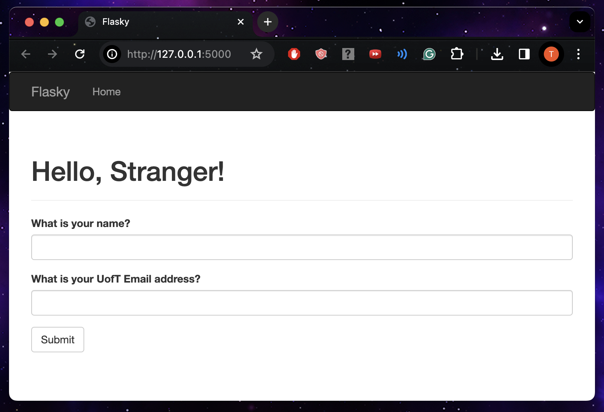

## Activity 1.4: step 3 
Fill in your first name and your UofT email address, click submit

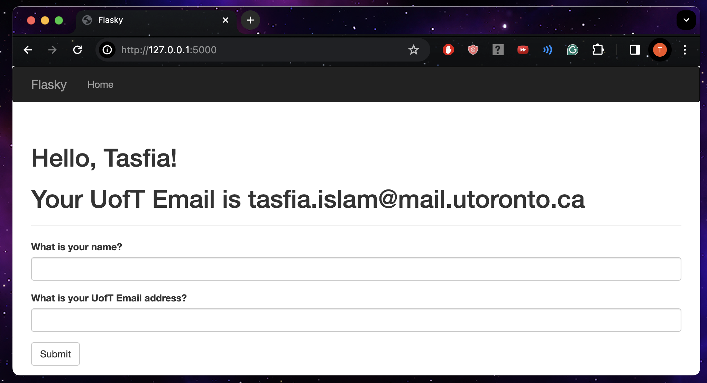

## Activity 1.4: step 4
Fill in your first name and last name in the 1st field, and fill in your first name in the 2nd field, click submit. You will receive an error message 

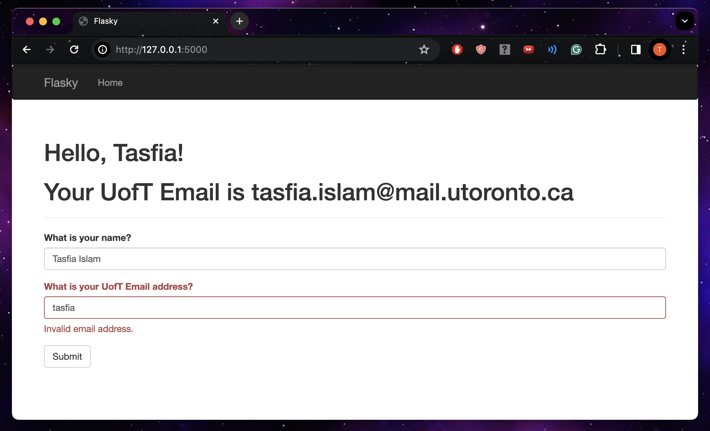

## Activity 1.4: step 5 (Final Screenshot)
Fill in your first name and last name in the 1st field, and fill in your NON UofT email in the 2nd field, click submit. (Take  a screenshot)

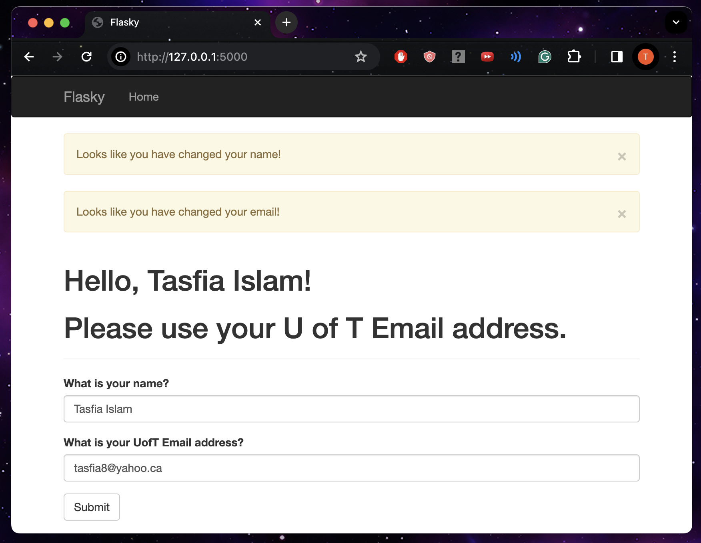

Extra:
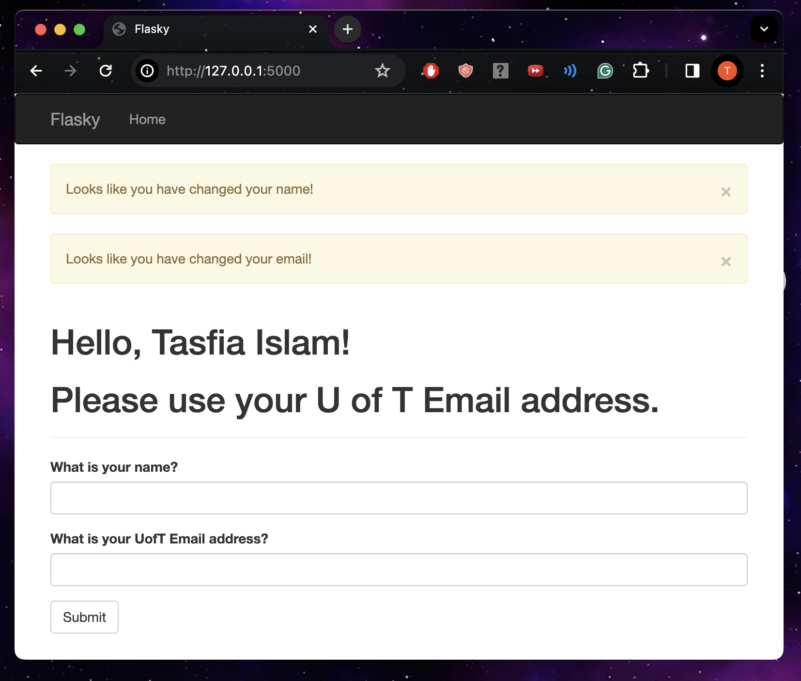

Aside note: Helpful Git Command: For large file issues, pushing from vs to git won't always work. 
You can increase git buffer size to 150 mb for example by this command:
(.venv) tasfiaislam@Tasfias-MBP ECE444-F2024-PRA2 % git config --global http.postBuffer 157286400

### Activity 2: Docker

## Activity 2.1: Create the PRA2_2 branch and pull the code 

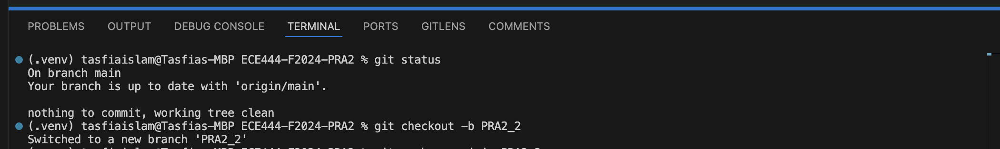

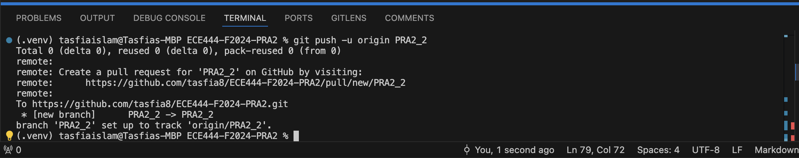

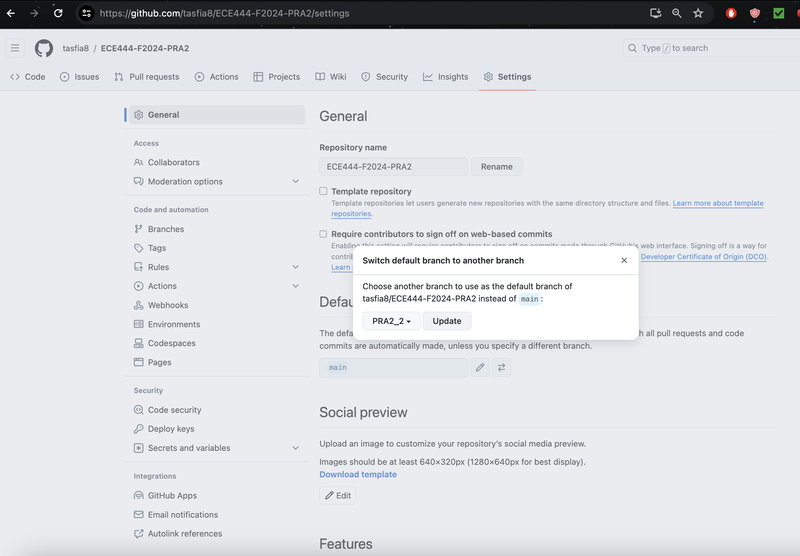

## Activity 2.2: Docker Install
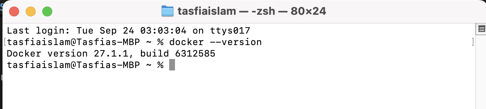

## Activity 2.3: Modify Activity 1.4: 

Run these Commands to run the application:

python3 -m venv .venv

. .venv/bin/activate

pip install Flask

pip install Flask-WTF WTForms

pip install email-validator

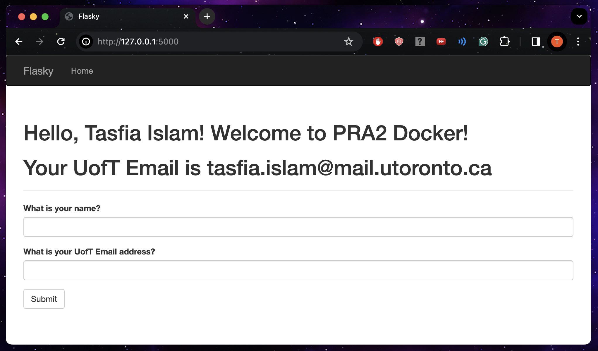

## Activity 2.4: Building and running the docker image locally 

Make sure to run in virtual environment like Flask in previous activity, go to root repo directory of local computer.

## Activity 2.4: Step 3 Build & Run
 *First activate virtual env:*
 
 python3 -m venv .venv   
. .venv/bin/activate 

*Build:*

docker build -t tasfia:final .
 
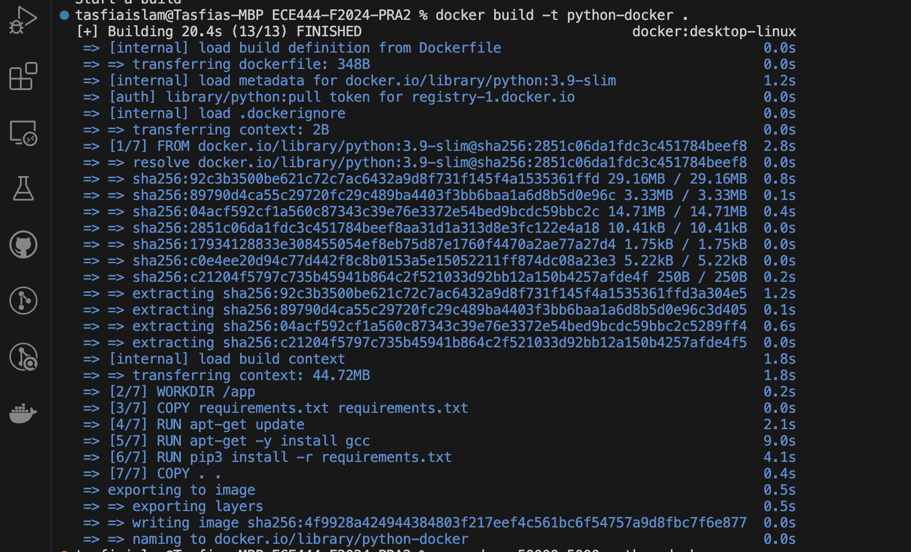

*Run:*

docker run -p 5001:5000 tasfia:final

Full Snippet of venv, build, run:

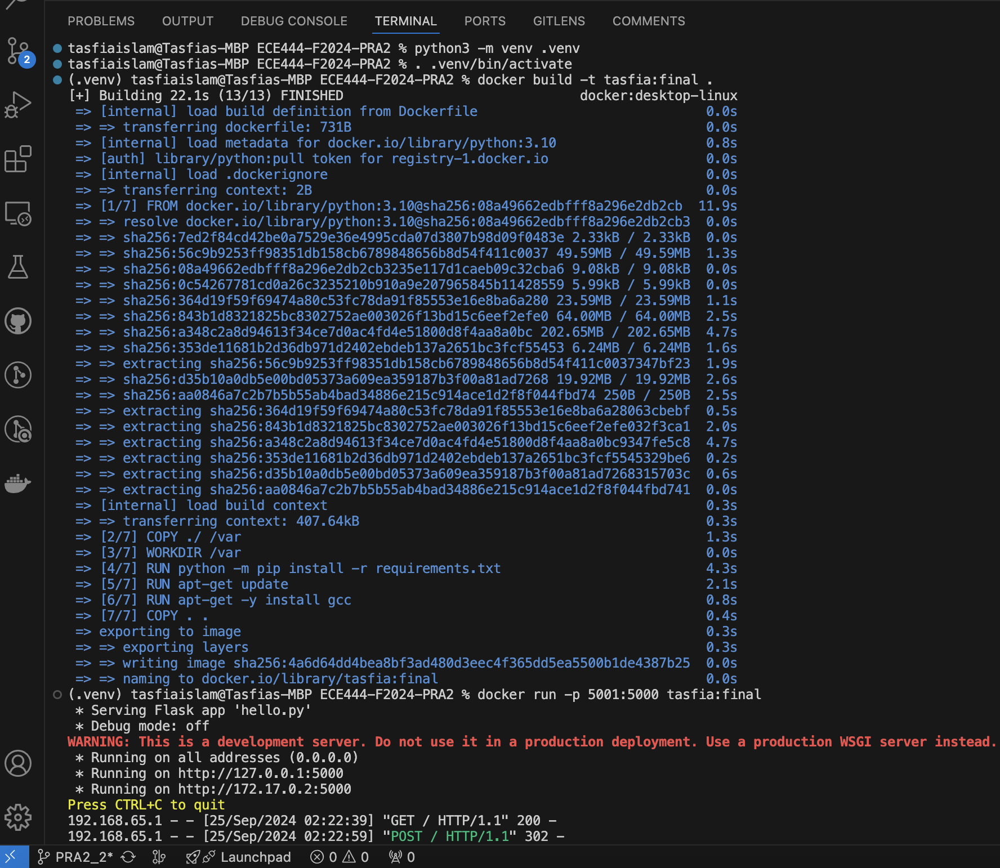

## Activity 2.4: Step 4 Application Run Website & Docker Application on Local Computer

Application running (Go to Docker Desktop application on local computer & click port):

*If port 5000:*

http://localhost:5000/

*If port 5001:*

http://localhost:5001/

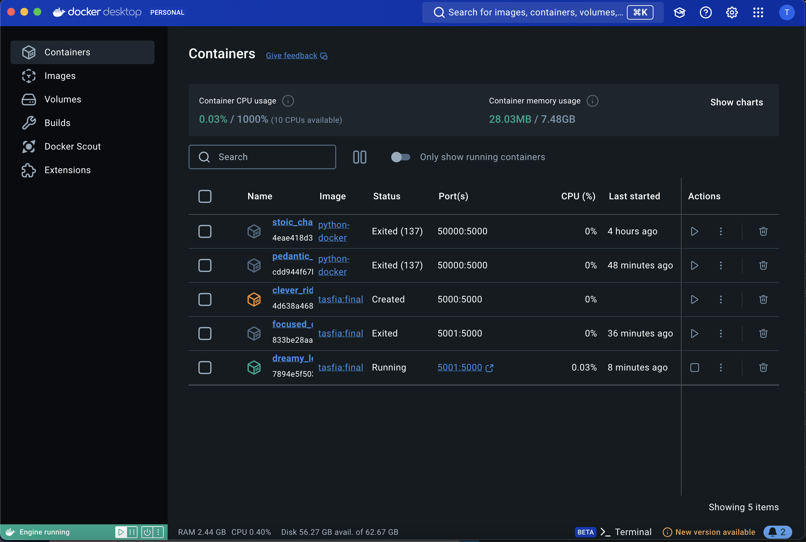

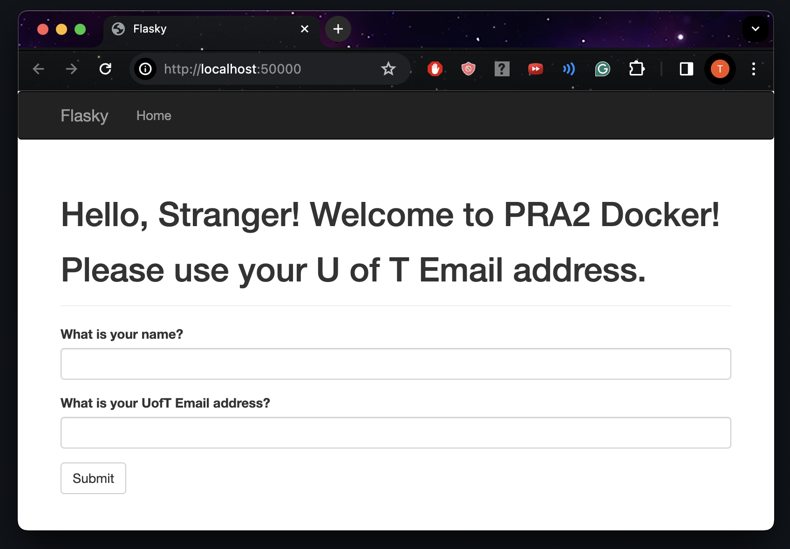

CAREFUL: do this command only after you CTRL+C and exit but it's okay if you still stay in venv. To show the containers currently running, used <docker ps –a>, then saw the log information indicating the running application. 

docker ps -a

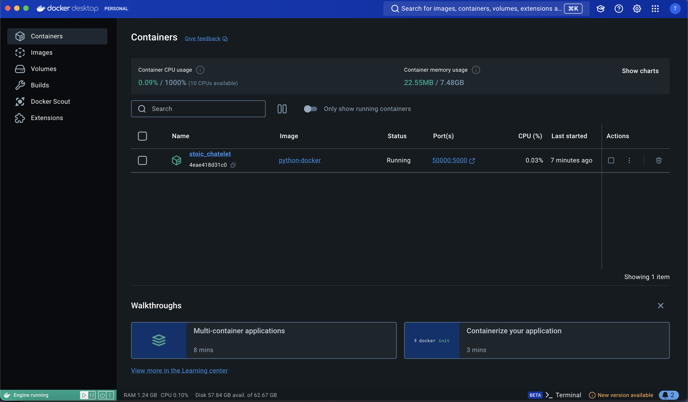

### To Test FLASK and Docker Simultaneously:
**First run Docker Terminal in VS Code:**
First check which branch you are in

(.venv) tasfiaislam@Tasfias-MBP ECE444-F2024-PRA2 % **git branch**
 (HEAD detached at 0881438)
  PRA2_2
  Main

(.venv) tasfiaislam@Tasfias-MBP ECE444-F2024-PRA2 % **git checkout PRA2_2**
If you get error untracked files error: The following untracked working tree files would be overwritten by checkout:

Then do stash line below:

(Optional)(.venv) tasfiaislam@Tasfias-MBP ECE444-F2024-PRA2 % git stash --include-untracked

(.venv) tasfiaislam@Tasfias-MBP ECE444-F2024-PRA2 % **docker build -t tasfia:final .**

If you get error ERROR: failed to solve: python:3.10: then do

(.venv) tasfiaislam@Tasfias-MBP ECE444-F2024-PRA2 % **docker login**
Authenticating with existing credentials...
Login Succeeded

(.venv) tasfiaislam@Tasfias-MBP ECE444-F2024-PRA2 % **docker build -t tasfia:final .**

(.venv) tasfiaislam@Tasfias-MBP ECE444-F2024-PRA2 % **docker run -p 5001:5000 tasfia:final**

**Then run Flask Activity 1.3 Time Exercise in another Terminal of VS Code:**

Open new terminal. First if you r in venv already, deactivate and activate again: 

python3 -m venv .venv
. .venv/bin/activate

(.venv) tasfiaislam@Tasfias-MBP ECE444-F2024-PRA2 % git checkout main
Switched to branch 'main'
Your branch is up to date with 'origin/main'.
(.venv) tasfiaislam@Tasfias-MBP ECE444-F2024-PRA2 % git checkout 
0881438 
Note: switching to '0881438'.

You are in 'detached HEAD' state. You can look around, make experimental
changes and commit them, and you can discard any commits you make in this
state without impacting any branches by switching back to a branch.

If you want to create a new branch to retain commits you create, you may
do so (now or later) by using -c with the switch command. Example:

  git switch -c <new-branch-name>

Or undo this operation with:

  git switch -

Turn off this advice by setting config variable advice.detachedHead to false

HEAD is now at 0881438 Activity 1.3 Completed1 Chapter3

(.venv) tasfiaislam@Tasfias-MBP ECE444-F2024-PRA2 % pip install Flask

(.venv) tasfiaislam@Tasfias-MBP ECE444-F2024-PRA2 % export FLASK_APP=hello.py

(.venv) tasfiaislam@Tasfias-MBP ECE444-F2024-PRA2 % pip install flask-moment

(.venv) tasfiaislam@Tasfias-MBP ECE444-F2024-PRA2 % flask run  
