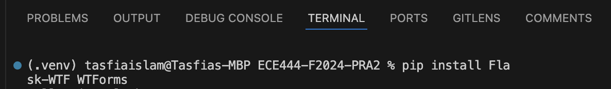
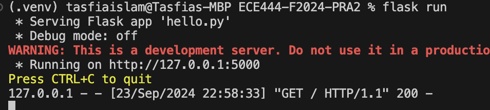
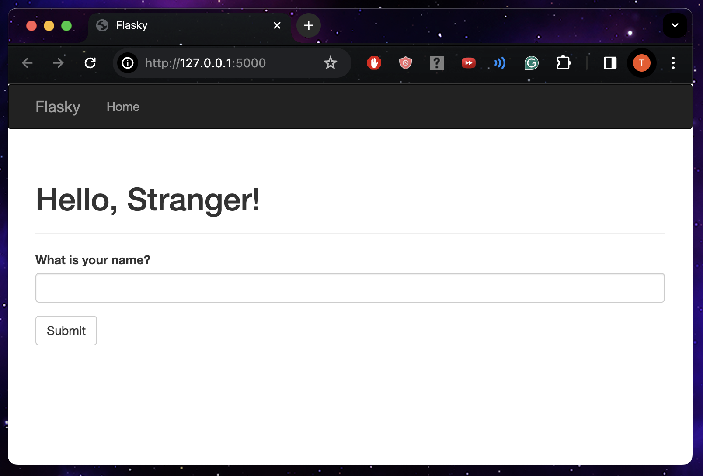

# Author: Tasfia Mehbuba Islam
Lab 2 Flask Web Development + Docker

This repo is a clone of https://github.com/miguelgrinberg/flasky

### Activity 1.2: Creating a repo and replay the textbook example

Install Flask, run flask within ECE444-F2024-PRA2 following instructions:
https://flask.palletsprojects.com/en/3.0.x/installation/

## Activity 1.2: Example 2-1

## Activity 1.2: Example 2-2

### Activity 1.3: Replaying and modifying example in Chapter 3 

### Activity 1.4: Replaying and modifying example in Chapter 4

## Activity 1.4: step 1 - Example 4-7 (Hello Stranger, What is your name?)

Alongside installing, running flask in Activity 1.4 had to install flask-wtf wtforms otherwise import doesn't work

After installing flask within the active virtual environment, then do : pip install Flask-WTF WTForms
then do flask run

Then go to http://127.0.0.1:5000/

