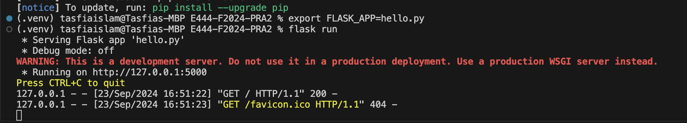
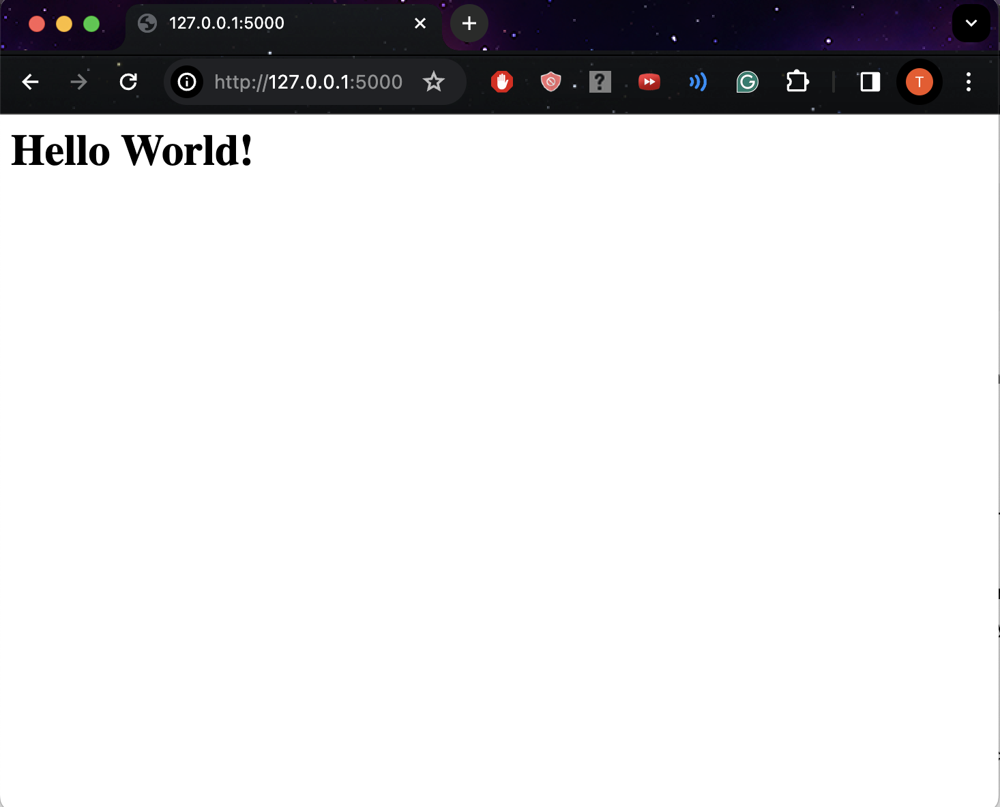
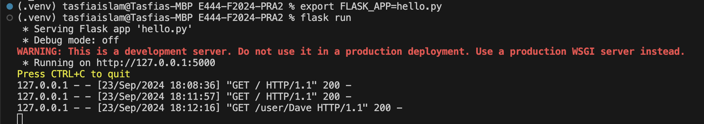
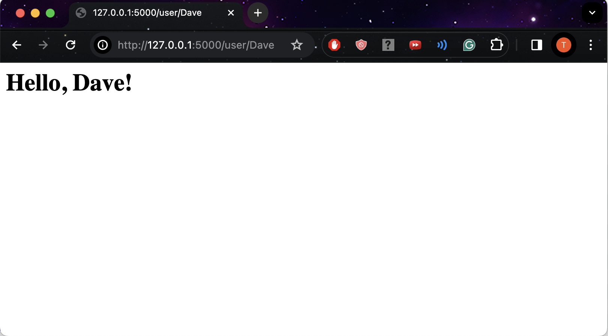
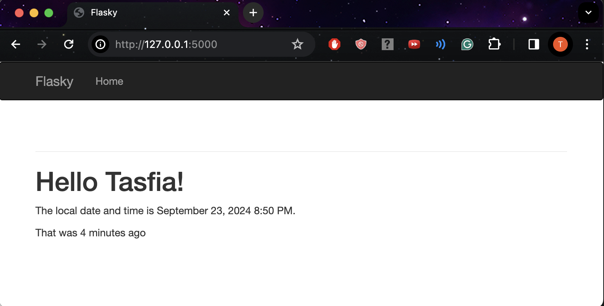
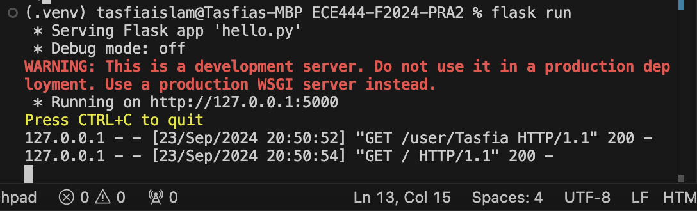

# Author: Tasfia Mehbuba Islam
Lab 2 Flask Web Development + Docker

This repo is a clone of https://github.com/miguelgrinberg/flasky

### Activity 1.2: Creating a repo and replay the textbook example

## Activity 1.2: Example 2-1

## Activity 1.2: Example 2-2

### Activity 1.3: Replaying and modifying example in Chapter 3 

