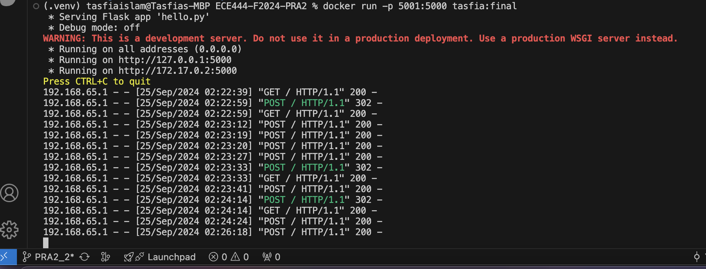
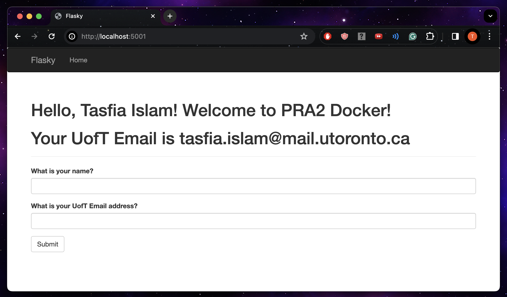
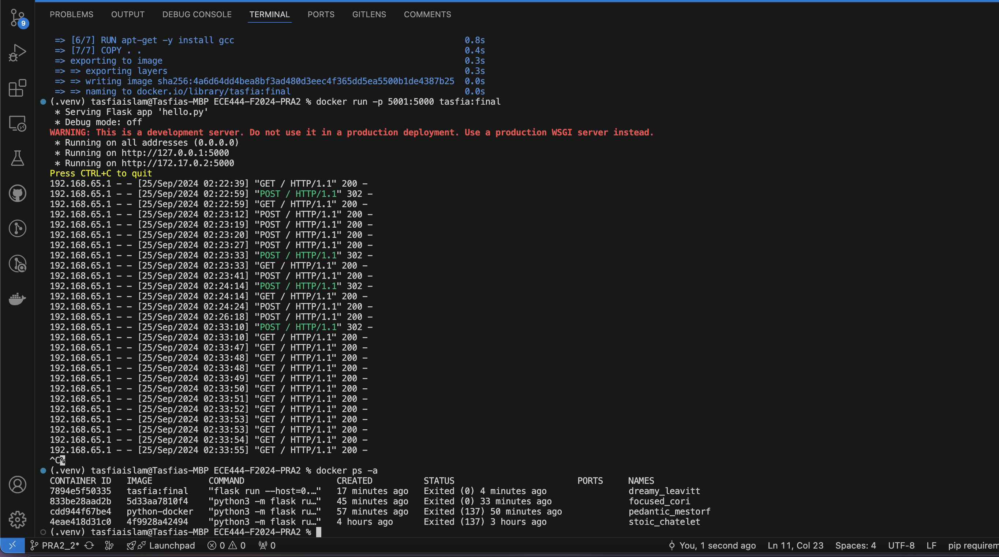

# Author: Tasfia Mehbuba Islam
Lab 2 Flask Web Development + Docker

This repo is a clone of https://github.com/miguelgrinberg/flasky

### Activity 1.2: Creating a repo and replay the textbook example

Install Flask, run flask within ECE444-F2024-PRA2 following instructions:
https://flask.palletsprojects.com/en/3.0.x/installation/

## Activity 1.2: Example 2-1

## Activity 1.2: Example 2-2

### Activity 1.3: Replaying and modifying example in Chapter 3 

### Activity 1.4: Replaying and modifying example in Chapter 4

## Activity 1.4: step 1 - Example 4-7 (Hello Stranger, What is your name?)

Alongside installing, running flask in Activity 1.4 had to install flask-wtf wtforms otherwise import doesn't work

After installing flask within the active virtual environment, then do : pip install Flask-WTF WTForms
then do flask run

Then go to http://127.0.0.1:5000/

## Activity 1.4: step 2 - Email, Name - Hello, Stranger!

Alongside installing, running flask in Activity 1.4 had to install flask-wtf wtforms, email-validators otherwise import doesn't work.

After installing flask within the active virtual environment, then do : pip install Flask-WTF WTForms
then do pip install email-validator

Optional step: to verify installation: pip freeze

Then do flask run

## Activity 1.4: step 3 
Fill in your first name and your UofT email address, click submit

## Activity 1.4: step 4
Fill in your first name and last name in the 1st field, and fill in your first name in the 2nd field, click submit. You will receive an error message 

## Activity 1.4: step 5 (Final Screenshot)
Fill in your first name and last name in the 1st field, and fill in your NON UofT email in the 2nd field, click submit. (Take  a screenshot)

Extra:

Aside note: Helpful Git Command: For large file issues, pushing from vs to git won't always work. 
You can increase git buffer size to 150 mb for example by this command:
(.venv) tasfiaislam@Tasfias-MBP ECE444-F2024-PRA2 % git config --global http.postBuffer 157286400

### Activity 2: Docker

## Activity 2.1: Create the PRA2_2 branch and pull the code 

## Activity 2.2: Docker Install

## Activity 2.3: Modify Activity 1.4: 

Run these Commands to run the application:

python3 -m venv .venv

. .venv/bin/activate

pip install Flask

pip install Flask-WTF WTForms

pip install email-validator

## Activity 2.4: Building and running the docker image locally 

Make sure to run in virtual environment like Flask in previous activity, go to root repo directory of local computer.

## Activity 2.4: Step 3 Build & Run
 *First activate virtual env:*
 
 python3 -m venv .venv   
. .venv/bin/activate 

*Build:*

docker build -t tasfia:final .
 

*Run:*

docker run -p 5001:5000 tasfia:final

Full Snippet of venv, build, run:

## Activity 2.4: Step 4 Application Run Website & Docker Application on Local Computer

Application running (Go to Docker Desktop application on local computer & click port):

*If port 5000:*

http://localhost:5000/

*If port 5001:*

http://localhost:5001/

CAREFUL: do this command only after you CTRL+C and exit but it's okay if you still stay in venv. To show the containers currently running, used <docker ps –a>, then saw the log information indicating the running application. 

docker ps -a

